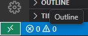

# Dev Container Quick Visual Guide

Drop your screenshots into `docs/images/` with the filenames below and they will appear here.

## How to open the dev container

Below are the images currently found in `docs/images/`. If you add or rename images in that folder they will appear here after reloading the preview.

### Rebuild / Reopen in VS Code

### Reopen Remote Host

Notes:
- If you prefer different filenames, you can either rename your image files to `devcontainer-vscode.png`, `docker-run.png`, and `remote-host.png`, or keep your current names and this page will show them as-is.
- After changing images, reload the Markdown preview in VS Code (View -> Markdown Preview) or re-open the file to refresh the display.
